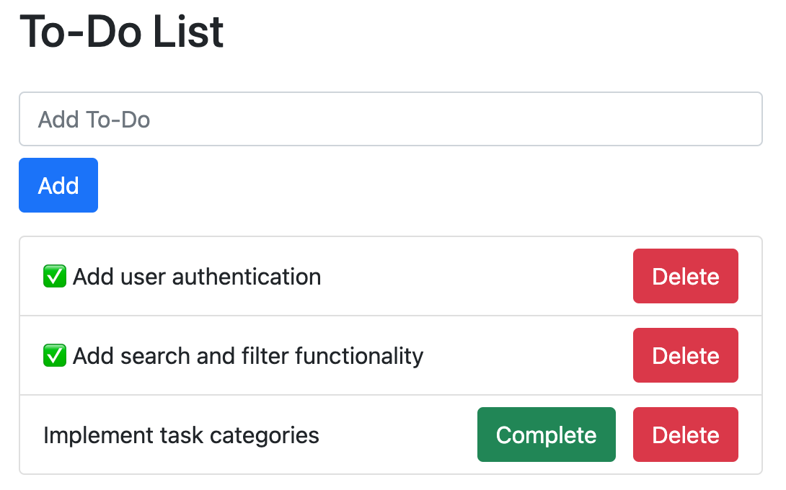

# To-Do List Web Application

This is a simple to-do list web application built with FastAPI and Vue.js. It allows you to create, read, complete, and
delete to-do items. To-do items are stored in a SQLite database using SQLAlchemy.



## Installation

To run this application locally, you need to have Python 3.7 or later installed on your system. You also need to install
the dependencies by running the following command in the project directory:

```bash
pip install -r requirements.txt
```

## Usage

To start the application, run the following command in the project directory:

```bash
make run
```

This will start a development server. You can access the web interface by visiting `http://127.0.0.1:8000/` in your web
browser. From there, you can create, read, complete, and delete to-do items.

## Testing
You can run the tests with the following command:
```bash
make test
```


## Cleaning up

To clean up any cached files, run the following command:
```base
make clean
```

## License

This project is licensed under the terms of the MIT license. See the `LICENSE` file for details.
